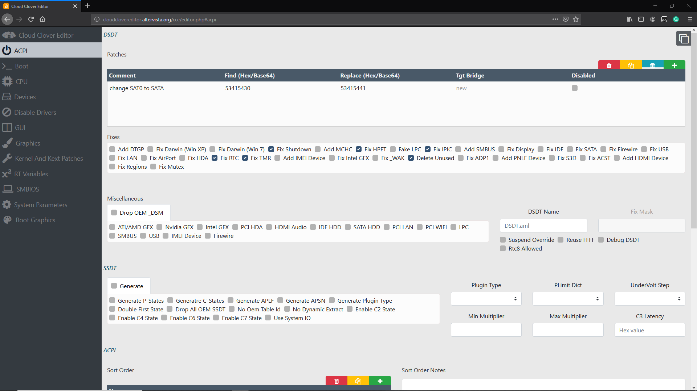
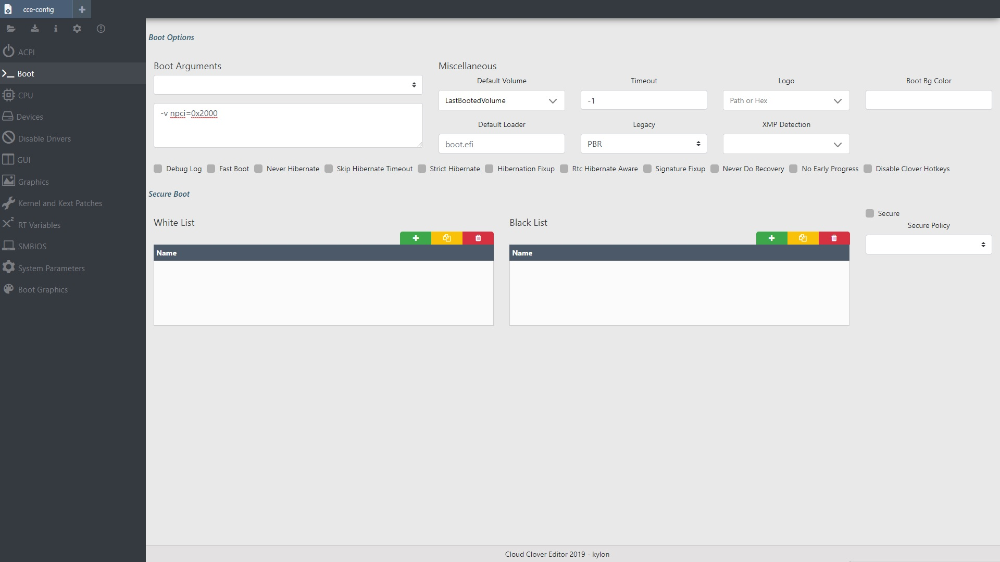
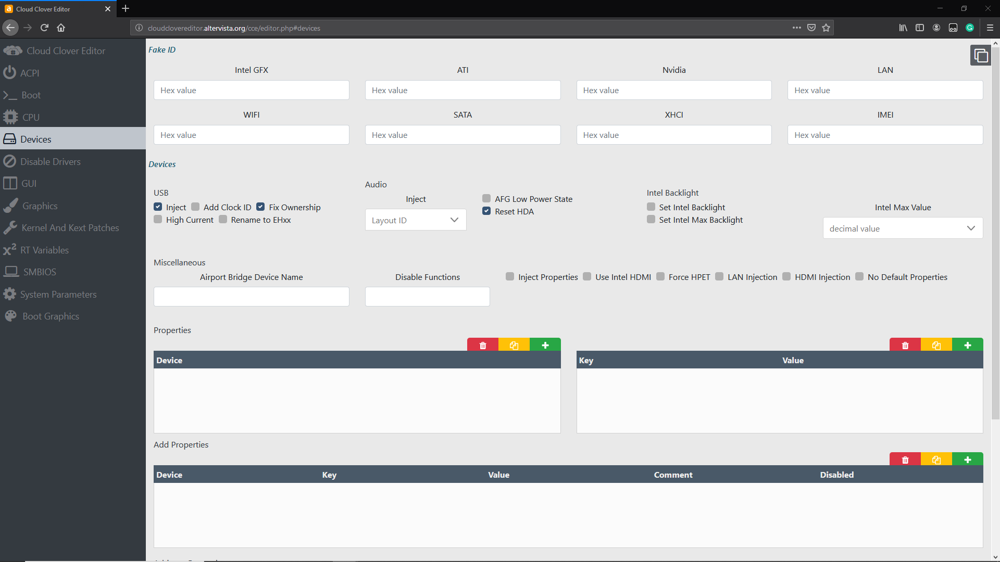
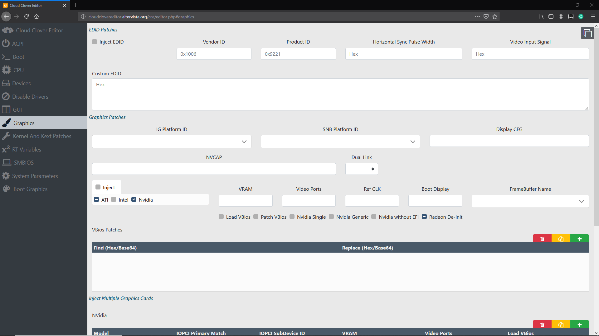
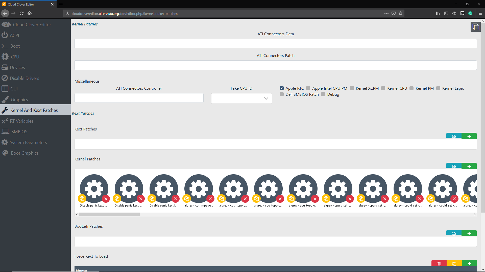
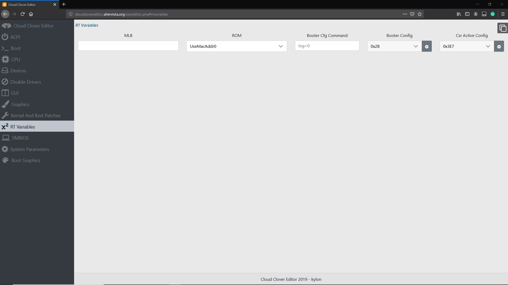
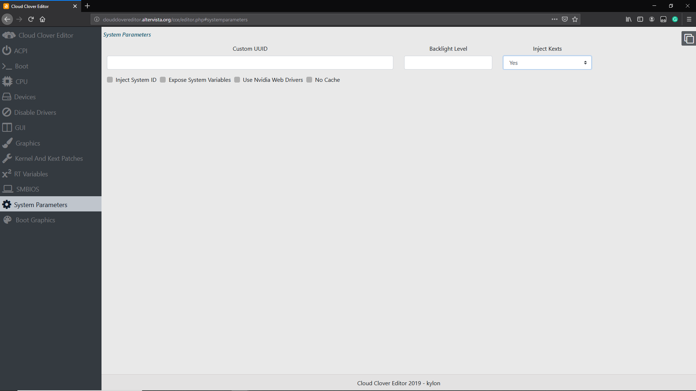

# AMD Clover config.plist

## Before anything

* Please get the patches.plist \([Ryzen](https://raw.githubusercontent.com/AMD-OSX/AMD_Vanilla/master/17h/patches.plist), [FX](https://raw.githubusercontent.com/AMD-OSX/AMD_Vanilla/master/15h_16h/patches.plist)\) from AMD OS X Github \(Right click, Save Page As, Remember to change the suffix to .plist\)
* Open patches.plist with Clover Configurator \(CCG\) or [Clover Cloud Editor](http://cloudclovereditor.altervista.org/cce/index.php) \(CCE\).


**If you are using CCE**, pleasee go to home page and set _`Show Find/Replace/TgtBridge values as: Hex`_because the following CCE screenshots are in Hex.


## ACPI

### RAW XML

```markup
<key>ACPI</key>
<dict>
	<key>DSDT</key>
	<dict>
		<key>Fixes</key>
		<dict>
			<key>DeleteUnused</key>
			<true/>
			<key>FixHPET</key>
			<true/>
			<key>FixRTC</key>
			<true/>
			<key>FixShutdown</key>
			<true/>
			<key>FixTMR</key>
			<true/>
			<key>FixIPIC</key>
			<true/>
		</dict>
		<key>Patches</key>
		<array>
			<dict>
				<key>Comment</key>
				<string>change SAT0 to SATA</string>
				<key>Disabled</key>
				<false/>
				<key>Find</key>
				<data>U0FUMA==</data>
				<key>Replace</key>
				<data>U0FUQQ==</data>
			</dict>
		</array>
	</dict>
	<key>FixHeaders</key>
	<true/>
</dict>
```

### **Explanations**

**Patches:**

The first thing we'll go over is the _Patches_ section. This section allows us to dynamically rename parts of the DSDT via Clover. Since we're not running a real mac, and macOS is pretty particular with how things are named, we can make non-destructive changes to keep things mac-friendly. We have three entries here:

* _change SAT0 to SATA_ - for potential SATA compatibility

**Enable Fix Shutdown**

* This can fix some shutdown issues like reboot instead of shutting down. But this might also cause shutdown issues on some board. So if you are having some issues with shutting down, disable this.

**Enable Fix IPIC, TMR, HPET and RTC**

* This can fix audio after installing AppleALC and applying a correct layout ID.

### CCE Screenshot



## Boot

### RAW XML

```markup
<key>Boot</key>
<dict>
	<key>Arguments</key>
	<string>-v npci=0x2000</string>
	<key>DefaultVolume</key>
	<string>LastBootedVolume</string>
	<key>Legacy</key>
	<string>PBR</string>
	<key>Timeout</key>
	<integer>-1</integer>
</dict>
```

### Explanations

**Arguments:**

* **-v** - enable verbose which shows all the _behind-the-scenes_ text that scrolls by as you're booting instead of the Apple logo and progress bar. It is very helpful for tracking issues are fixing them.
* **npci=0x2000** - a fix for stuck at \[PCI Configuration Start\].

**Default Volume** - setting the default volume for booting. 

* **LastBootedVolume** - let Clover uses the last booted volume \(no matter if it boot successfully\) as default.

**Timeout \(sec\)** - setting the timeout for auto-booting. 

* **-1** - disable auto-boot.

**Legacy \(PBR\)** - let Clover use PBR to boot legacy system.

### CCE Screenshot



## Boot Graphics \(which doesn't matter much\)

We have nothing to do here. You can tweak it if Clover doesn't show correctly.

## CPU

We have nothing to do here also.

## Devices

### RAW XML

```markup
<key>Devices</key>
<dict>
	<key>Audio</key>
	<dict>
		<key>ResetHDA</key>
		<true/>
	</dict>
	<key>USB</key>
	<dict>
		<key>Inject</key>
		<true/>
		<key>FixOwnership</key>
		<true/>
	</dict>
</dict>
```

### Explanations

* **Reset HDA** - Puts the codec back in a neutral state between OS reboots. This prevents some issues with no audio after booting to another OS and then back.
* **USB** - Under this section, we ensure that _Inject_ and _FixOwnership_ are selected to avoid issues with hanging at a half-printed line somewhere around the `Enabling Legacy Matching` verbose line. You can also get past that by enabling _XHCI Hand Off_ in BIOS.

### CCE Screenshot



## Disable Drivers <a id="disable-drivers"></a>

We have nothing to do here.

## GUI

### RAW XML

```markup
<key>GUI</key>
<dict>
	<key>Scan</key>
	<dict>
		<key>Entries</key>
		<true/>
		<key>Linux</key>
		<true/>
		<key>Tool</key>
		<true/>
	</dict>
</dict>
```

### Explanation

**Scan:**

The only settings I've tweaked on this page are the _Scan_ settings. I've selected _Custom_, then checked everything except _Legacy_ and _Kernel_. This just omits some of the unbootable entries in Clover to clean up the menu.

### CCE Screenshot



## Graphics

### RAW XML

```markup
<key>Graphics</key>
<dict>
	<key>Inject</key>
	<false/>
	<key>RadeonDeInit</key>
	<false/>
</dict>
```

**Please refer to** [**GPU Buyers Guide**](https://khronokernel-3.gitbook.io/catalina-gpu-buyers-guide/) **and see which settings do you need for your GPU.**

## Kernel And Kexts Patches

The patches.plist \(which you are editing\) already has all of the patches you want to have. Those patches are used to patch the native Kernel.

* **AppleRTC \(enabled\)** - this ensures that we don't have a BIOS reset on reboot.

### CCE Screenshot



## Rt Variables and SMBIOS

### RAW XML \(Rt Variables\)

```markup
<key>RtVariables</key>
<dict>
	<key>BooterConfig</key>
	<string>0x28</string>
	<key>CsrActiveConfig</key>
	<string>0x3e7</string>
	<key>ROM</key>
	<string>UseMacAddr0</string>
</dict>
```

### Explanation

**RT Variables:** \(From CorpNewt's Vanilla Guide\)

We set _Rt Variables -&gt; ROM_ to `UseMacAddr0` which just utilizes our onboard Mac address - this should be unique enough to not conflict with any others.

_BooterConfig_ gets set to `0x28`, and _CsrActiveConfig_ is set to `0x3e7` which effectively disables SIP **as SIP is not supported on AMD Systems unfortunately**.

**SMBIOS:**

[Please read this page after saving the config](smbios.md)

### CCE Screenshot



## System Parameters

### RAW XML

```markup
<key>SystemParameters</key>
<dict>
	<key>InjectKexts</key>
	<string>Yes</string>
	<key>InjectSystemID</key>
	<true/>
</dict>
```

### **Explanations**

**Inject Kexts:**

This setting has 3 modes:

* `Yes` - this tells Clover to inject kexts from the EFI regardless.
* `No` - this tells Clover not to inject kexts from the EFI.
* `Detect` - this has Clover inject kexts only if _FakeSMC.kext_ or _VirtualSMC.kext_ are not in the kext cache.

We set it to `Yes` to make sure that all the kexts we added before get injected properly.

**Inject System ID:**

This setting tells clover to set the SmUUID as the `system-id` at boot - which is important for iMessage and such.

**NvidiaWeb:**

This setting will force `nvda_drv=1` on every boot, this is recommended for users with non-functional NVRAM ****\(EmuVariableUEFI\) or issues switching from the default macOS drivers to the Nvidia WebDrivers.

### CCE Screenshot



## Save and Exit

At this point, you can do _File -&gt; Save_ to save the config.plist \(or go back to home page and download your config.plist if you are using CCE\). Keep it to somewhere you'll remember.

