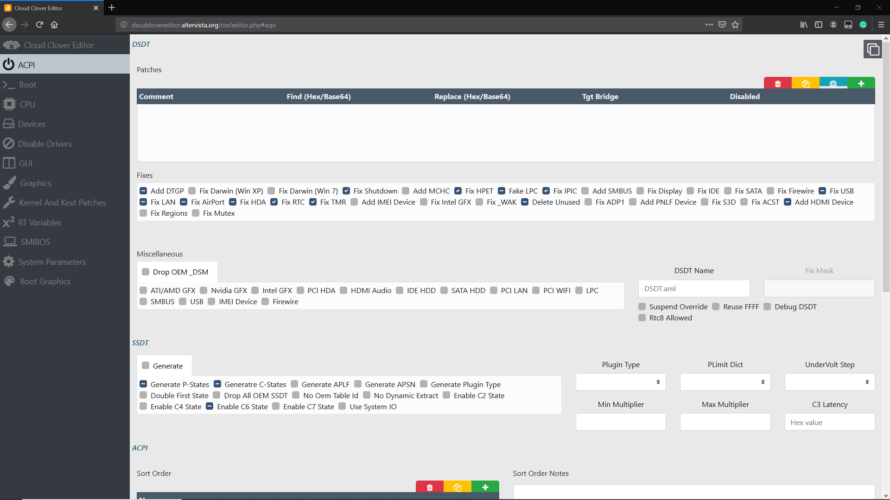
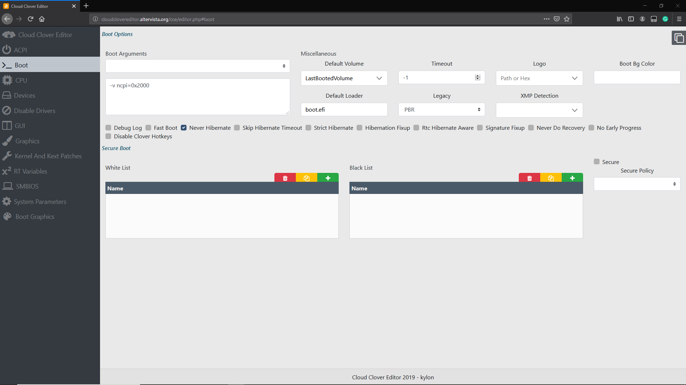
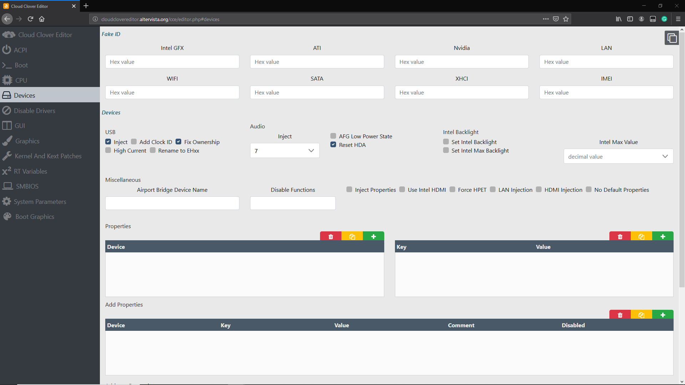
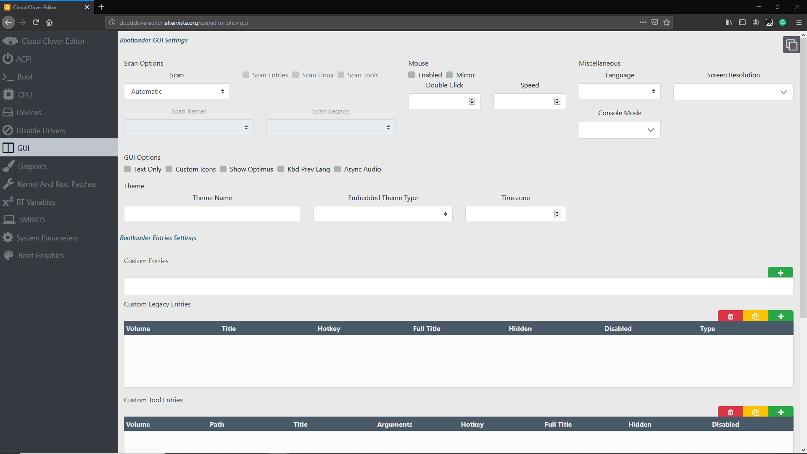
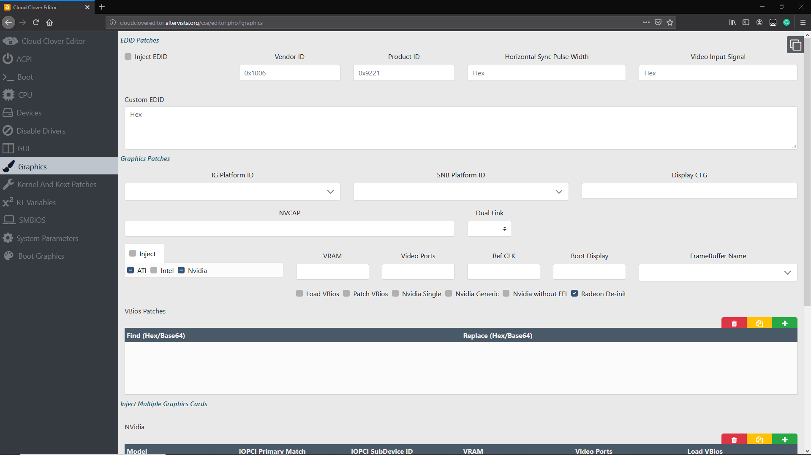
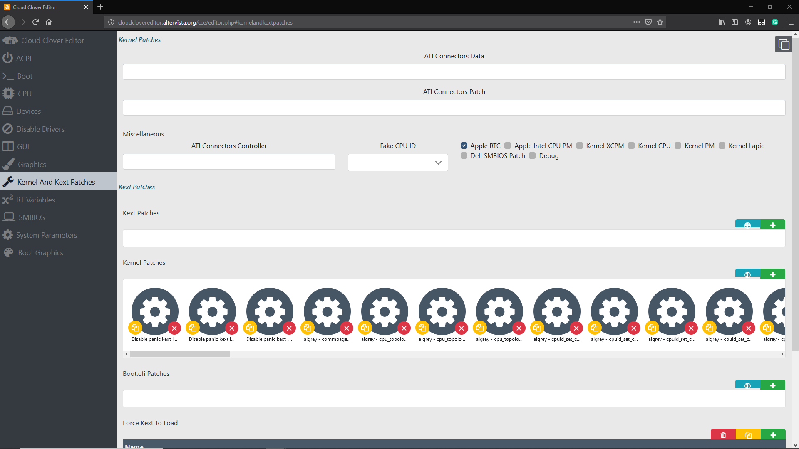
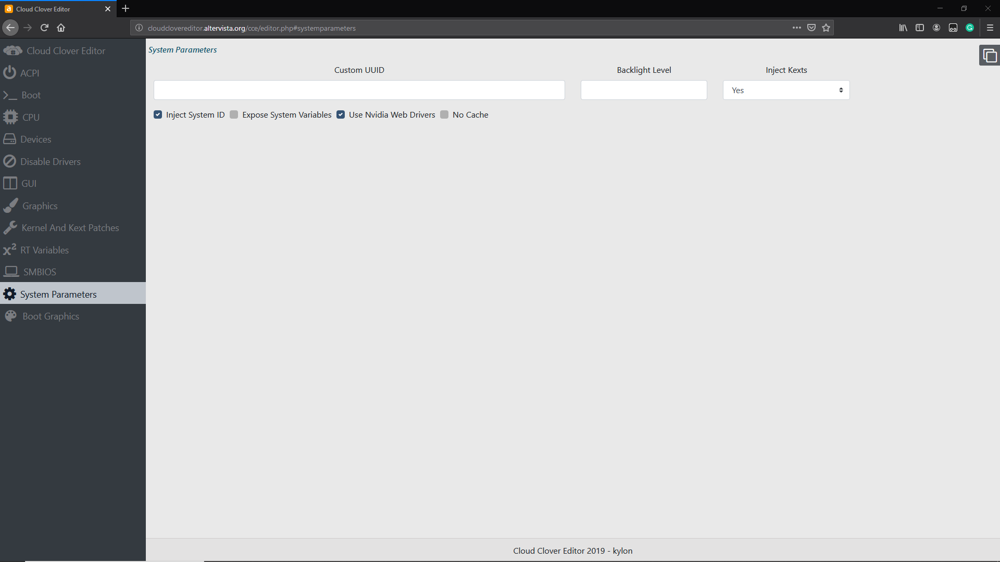

# AMD Clover config.plist

## Before anything

* Please get the patches.plist \([Ryzen](https://raw.githubusercontent.com/AMD-OSX/AMD_Vanilla/master/17h/patches.plist), [FX](https://raw.githubusercontent.com/AMD-OSX/AMD_Vanilla/master/15h_16h/patches.plist)\) from AMD OS X Github \(Right click, Save Page As, Remember to change the suffix to .plist\)
* Open patches.plist with Clover Configurator \(CCG\) or Clover Cloud Editor \(CCE\).

## ACPI

### RAW XML

```markup
<key>ACPI</key>
<dict>
	<key>DSDT</key>
	<dict>
		<key>Fixes</key>
		<dict>
			<key>AddDTGP</key>
			<false/>
			<key>AddHDMI</key>
			<false/>
			<key>DeleteUnused</key>
			<false/>
			<key>FakeLPC</key>
			<false/>
			<key>FixAirport</key>
			<false/>
			<key>FixDisplay</key>
			<false/>
			<key>FixHDA</key>
			<false/>
			<key>FixHPET</key>
			<true/>
			<key>FixLAN</key>
			<false/>
			<key>FixRTC</key>
			<true/>
			<key>FixShutdown</key>
			<true/>
			<key>FixUSB</key>
			<false/>
			<key>FixTMR</key>
			<true/>
			<key>FixIPIC</key>
			<true/>
		</dict>
	</dict>
	<key>HaltEnabler</key>
	<true/>
	<key>SSDT</key>
	<dict>
		<key>EnableC6</key>
		<false/>
		<key>Generate</key>
		<dict>
			<key>CStates</key>
			<false/>
			<key>PStates</key>
			<false/>
		</dict>
	</dict>
</dict>
```

### **Explanations**

**Enable Fix Shutdown and Halt Enabler**

* This can fix some shutdown issues like reboot instead of shutting down. But this might also cause shutdown issues on some board. So if you are having some issues with shutting down, disable this.

**Enable Fix IPIC, TMR, HPET and RTC**

* This can fix "no audio issue" after installing AppleALC and applying a correct layout ID.

**Other fixes**

* Those are some generic fixes which may cause problems. So we disable them.

### CCE Screenshot



## Boot

### Raw XML

```markup
<key>Boot</key>
<dict>
	<key>Arguments</key>
	<string>-v npci=0x2000</string>
	<key>DefaultLoader</key>
	<string>boot.efi</string>
	<key>DefaultVolume</key>
	<string>LastBootedVolume</string>
	<key>Legacy</key>
	<string>PBR</string>
	<key>NeverHibernate</key>
	<true/>
	<key>Timeout</key>
	<integer>-1</integer>
</dict>
```

### Explanations

**Arguments:**

* **-v** - enable verbose which shows all the _behind-the-scenes_ text that scrolls by as you're booting instead of the Apple logo and progress bar. It is very helpful for tracking issues are fixing them.
* **npci=0x2000** - a fix for stuck at \[PCI Configuration Start\].

**Never Hibernate** - it let Clover ignore hibernating.

**Timeout** - setting the timeout for auto-booting. -1 means disable auto-boot.

**Legacy \(PBR\)** - let Clover use PBR to boot legacy system.

### CCE Screenshot



## Boot Graphics \(which doesn't matter much\)

We have nothing to do here. You can tweak it if Clover doesn't show correctly.

## CPU

We have nothing to do here also.

## Devices

### RAW XML

```markup
<key>Devices</key>
<dict>
	<key>Audio</key>
	<dict>
		<key>Inject</key>
		<integer>7</integer>
		<key>ResetHDA</key>
		<true/>
	</dict>
	<key>USB</key>
	<dict>
		<key>Inject</key>
		<true/>
		<key>FixOwnership</key>
		<true/>
	</dict>
</dict>
```

### Explanations

* **Reset HDA** - Puts the codec back in a neutral state between OS reboots. This prevents some issues with no audio after booting to another OS and then back.
* **Inject \(Audio\)** - For enabling your audio codec. Find your own layout id of your audio codec [here](https://github.com/acidanthera/AppleALC/wiki/Supported-codecs) and replace 7 with it. **Use with AppleALC**. FX users can ignore.
* **USB** - Under this section, we ensure that _Inject_ and _FixOwnership_ are selected to avoid issues with hanging at a half-printed line somewhere around the `Enabling Legacy Matching` verbose line. You can also get past that by enabling _XHCI Hand Off_ in BIOS.

### CCE Screenshot



## Disable Drivers <a id="disable-drivers"></a>

We have nothing to do here.

## GUI

### RAW XML

```markup
<key>GUI</key>
<dict>
	<key>Scan</key>
	<true/>
</dict>
```

### Explanation

The only tweaking is enabling auto scanning entries.

### CCE Screenshot



## Graphics

### RAW XML

```markup
<key>Graphics</key>
<dict>
	<key>Inject</key>
	<dict>
		<key>ATI</key>
		<false/>
		<key>NVidia</key>
		<false/>
	</dict>
	<key>RadeonDeInit</key>
	<true/>
</dict>
```

### Explanations

* **Injecting Graphics \(Inject ATI, Inject NVidia\)** - only set them to true if you have a old GPU.
* **Enabling RadeonDeInit** - enabling AMD RX GPUs.

### CCE Screenshot



## Kernel And Kexts Patches

The patches.plist \(which you are editing\) already has all of the patches you want to have. Those patches are used to patch the native Kernel.

* **AppleRTC \(enabled\)** - this ensures that we don't have a BIOS reset on reboot.

### CCE Screenshot



## Rt Variables and SMBIOS

### RAW XML

```markup
<key>RtVariables</key>
<dict>
	<key>BooterConfig</key>
	<string>0x28</string>
	<key>CsrActiveConfig</key>
	<string>0x3e7</string>
	<key>ROM</key>
	<string>UseMacAddr0</string>
</dict>
<key>SMBIOS</key>
<dict>
</dict>
```

### What we have done

**RT Variables:** \(From CorpNewt's Vanilla Guide\)

We set _Rt Variables -&gt; ROM_ to `UseMacAddr0` which just utilizes our onboard Mac address - this should be unique enough to not conflict with any others.

_BooterConfig_ gets set to `0x28`, and _CsrActiveConfig_ is set to `0x3e7` which effectively disables SIP. You can choose a number of other options to enable/disable sections of SIP. Some common ones are as follows:

* `0x0` - SIP completely enabled
* `0x3` - Allow unsigned kexts and writing to protected fs locations
* `0x3e7` - SIP completely disabled

**SMBIOS:**

We'll mention it [later](smbios.md).

### CCE Screenshot


## System Parameters

### RAW XML

```markup
<key>SystemParameters</key>
<dict>
	<key>InjectKexts</key>
	<string>Yes</string>
	<key>InjectSystemID</key>
	<true/>
	<key>NvidiaWeb</key>
	<true/>
</dict>
```

### **Explanations**

**Inject Kexts:**

This setting has 3 modes:

* `Yes` - this tells Clover to inject kexts from the EFI regardless.
* `No` - this tells Clover not to inject kexts from the EFI.
* `Detect` - this has Clover inject kexts only if _FakeSMC.kext_ or _VirtualSMC.kext_ are not in the kext cache.

We set it to `Yes` to make sure that all the kexts we added before get injected properly.

**Inject System ID:**

This setting tells clover to set the SmUUID as the `system-id` at boot - which is important for iMessage and such.

**NvidiaWeb:**

This setting tells clover to use NVidia Web Drivers. Enable this only if you have NVidia Web Drivers installed.

### CCE Screenshot



## Save and Exit

At this point, you can do _File -&gt; Save_ to save the config.plist \(or go back to home page and download your config.plist if you are using CCE\). If you have issues saving directly to the EFI, you can save it on the Desktop, then just copy it over.

