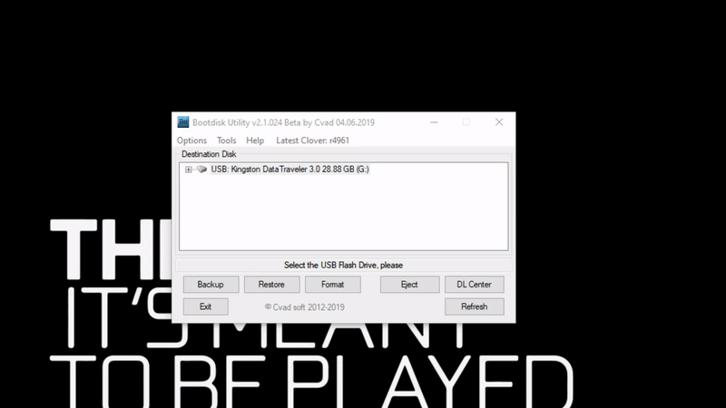
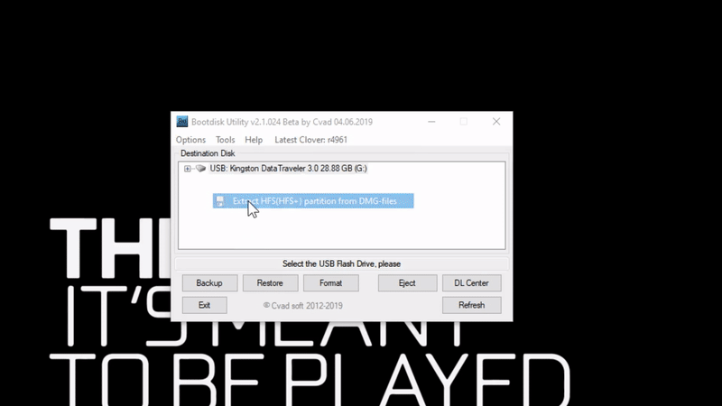
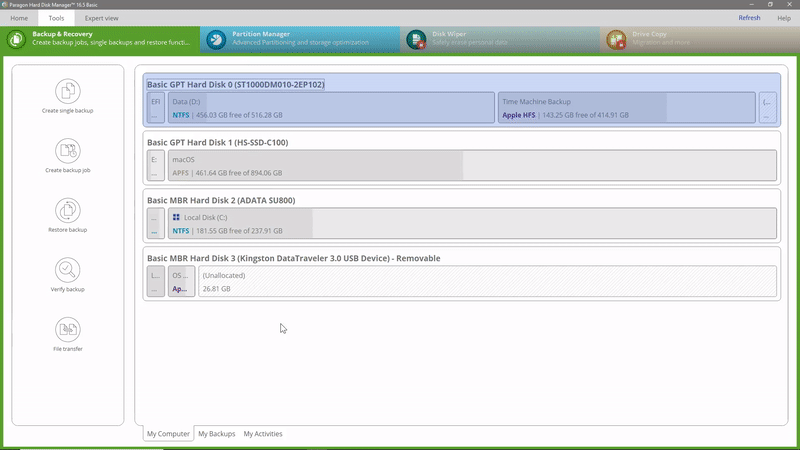

# From Windows \(Offline Installer\)

## Before doing anything, you need to prepare:

* **BaseSystem.dmg** from the [macOS Installer app](../get-started/prerequisites.md#things-need-to-get-if-you-are-making-the-installer-in-windows) Location: `macOS Install xxxx.app/Contents/SharedSupport`

## Part 1 - Installing Clover with BDUtility

1. Plug in your USB.
2. Run Boot Disk Utility. Your USB should be listed.
3. Go to Options &gt; Configuration.
4. Click the `Check Now` button of Check at Startup.
5. After some blue words appear, you can close that window.
6. Select your USB and click Format.
7. Click OK. It will take some time.
8. When it says All done, you can proceed to the next part.

## Part 2 - Restoring macOS Installer Files

1. Go to Tools &gt; Extract HFS\(HFS+\) partition from DMG-files.
2. Choose the BaseSystem.dmg mentioned [above](from-windows-direct-download.md#before-doing-anything-you-need-to-prepare). Then press Open.
3. Choose a place for saving the extracted file. Remember it. Then press OK.
4. A prompt window will pop up and it will auto extract a file called 4.hfs to the destination folder set above.
5. When it finishes, go back to BDUtility. Click the + sign in front of your USB and select Part2. Click Restore and select your extracted 4.hfs and click Open. It will take some time. Be patient.
6. Open up Paragon Hard Disk Manager.
7. If you have already activated, skip to Step 7. If not follow these steps:
   1. Click Activate.
   2. You can either create a new account or just log in with Facebook, Google or Twitter.
   3. Once you have logged in, the app should be activated.
8. Go to Partition Manager. Find your USB and select the second partition of your USB.
9. Right click on the second partition of your USB and click Resize Partition.
10. Click More Options and set Space after partition to 0.
11. Click OK and click Apply at the top left corner.
12. When it finishes, you can now proceed to [the next page]().

## Part 3 - Convert the Installer to Offline

1. Run TransMac as administrator.
2. Choose your USB in the sidebar.
3. Go into Install macOS Install xxxx.app/Contents
4. Open your downloaded macOS Installer app and go to Contents folder.
5. Copy SharedSupport from the downloaded app to `USB/Install macOS xxxx.app/Contents` with TransMac. It'll take some time.
6. Done! You can now [install Clover](configuring-clover-in-windows.md)!

